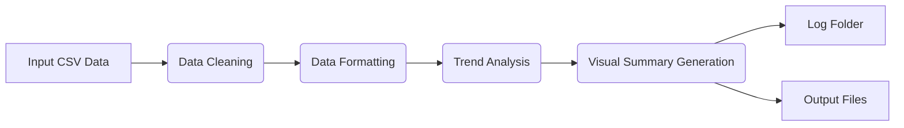
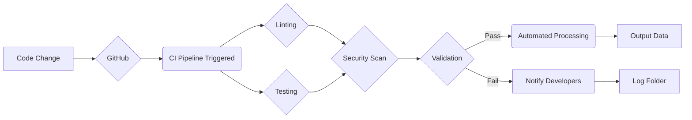

# DevOps CSV Automation

## 📌 Project Title
**DevOps CSV Automation**

## 📌 Requirements
- A data source (CSV file).
- A text editor or IDE (e.g., VS Code, PyCharm).
- Access to a terminal or command line.
- Permissions to install Python packages.
- Understanding of data processing concepts.
- A GitHub account (if using GitHub Actions).
- Basic understanding of CI/CD principles.

To run this project, you will need Python 3.14.3 (latest version), git, and the packages listed in `requirements.txt`.  A basic understanding of Python and CSV files is also helpful.

## 📌 What the system does
This project implements an automated data processing pipeline for CSV files. It ingests raw sales data, cleans it, formats it for dashboards, generates trend datasets, and creates visual summaries. The project demonstrates a complete DevOps lifecycle with CI/CD integration, automated testing, linting, security scanning, and automated data updates via GitHub Actions. Additionally, errors encountered during processing, particularly in data cleaning, trend analysis, and visual summary generation, are logged to the `log/` folder for troubleshooting.

## 📌 Project Overview
The DevOps CSV Automation project provides an automated data processing pipeline for CSV files, streamlining data ingestion, cleaning, formatting, and visualization. It includes CI/CD integration, automated testing, linting, and security scanning, ensuring a robust and reliable data workflow.

This project addresses the challenges of manually processing CSV files, which can be time-consuming and error-prone. By automating the data pipeline, this project aims to improve data quality, reduce processing time, and enable faster data-driven decision-making.

Key features include:
- Data cleaning and transformation
- Automated testing and validation
- CI/CD integration for continuous improvement
- Trend analysis no longer requires a timestamp column.
- The system attempts to convert string values in numeric columns to integers.
This project is intended for data analysts, DevOps engineers, and anyone who works with CSV data and wants to automate their workflow.

This project implements an automated data processing pipeline for CSV files. It ingests raw sales data, cleans it, formats it for dashboards, generates trend datasets, and creates visual summaries. The project demonstrates a complete DevOps lifecycle with CI/CD integration, automated testing, linting, security scanning, and automated data updates via GitHub Actions.


## 📌 Folder structure
```
devops-csv-automation/
-├── .github/                 # GitHub Actions configuration
+├── .github/                 # GitHub Actions configuration
│   └── workflows/
-│       └── ci.yml           # CI/CD pipeline definition
-├── src/                     # Source code directory
-│   ├── main.py              # Main entry point for the pipeline
-│   ├── pipeline.py          # Orchestrates the data processing pipeline
-│   ├── processing.py        # Contains core data processing functions
-│   └── validate.py          # Script to validate output data
-├── tests/                   # Test suite
-│   ├── test_main.py         # Integration tests for the pipeline
-│   └── test_processing.py   # Unit tests for processing functions
-├── output/                  # Directory for processed output files
-├── log/                     # Contains error logs
-│   ├── 01_chart_ready.csv   # Cleaned dataset for visualization
-│   ├── 04_dashboard.csv     # Dataset with normalized column names
-│   └── visual_summary.svg   # SVG representation of data distribution
-├── requirements.txt         # Python dependencies
-├── README.md                # Project documentation
-├── SECURITY.md              # Security policy
-└── .gitignore               # Specifies intentionally untracked files that Git should ignore
+│       └── ci.yml           # CI/CD pipeline definition

## 📌 How to install
1. **Clone the repository:**
   ```bash
   git clone https://github.com/your-username/devops-csv-automation.git
   cd devops-csv-automation
   ```

2. **Set up a virtual environment:**
   ```bash
   python -m venv venv
   # Windows
   venv\Scripts\activate
   # macOS/Linux
   source venv/bin/activate
   ```

3. **Install dependencies:**
   ```bash
   pip install -r requirements.txt
   ```

## 📌 How to run
To execute the data processing pipeline manually:
```bash
python src/main.py
```
+To execute the data processing pipeline manually, follow these steps: +1. Open a terminal or command prompt. +2. Navigate to the project directory. +3. Run the command: python src/main.py +This will read input data, process it, and generate files in the output/ directory.

## 📌 How to run tests
The project uses `pytest` for testing To run the tests, execute the following command in the project's root directory:.
```bash
python -m pytest
```

## 📌 Sample input & output
**Input:** Raw CSV data containing columns like `Date`, `Sales Amount`, and `Region`.

**Output:**
- `01_chart_ready.csv`: Cleaned dataset with missing values removed.
- `04_dashboard.csv`: Dataset with normalized column names (e.g., `Sales Amount` -> `sales_amount`).
- Visual Summary: An SVG representation of data distribution.

---

## 2️⃣ Document Each Function

### `prepare_chart_ready_data(df)`
**Purpose:**
Cleans the raw dataset to ensure it is ready for visualization by removing missing values (NaN). Missing values can cause issues with plotting libraries and lead to incomplete or misleading visualizations. This function identifies and removes rows containing any missing values, resulting in a cleaner dataset that is suitable for generating charts and graphs.

**Input:**
`df` (pandas DataFrame): Raw data that may contain missing values. The input DataFrame represents the initial, unprocessed data loaded from the CSV file.

**Output:**
DataFrame with missing values (NaN) removed. The output DataFrame is a cleaned version of the input, ready for charting and visualization without errors due to missing data points.


### `export_plot_dataset(csv_file)`
**Purpose:**
Exports a dataset to a CSV file, presumably for plotting or further analysis.

**Input:**
`csv_file` (string): The path to the CSV file to be exported.

**Output:**
None. This function writes data to a file but does not return any value.


### `generate_trend_dataset(df)`
**Purpose:**
Prepares data for time-series trend analysis by sorting the DataFrame by date. Time-series analysis requires the data to be sorted chronologically. This function sorts the DataFrame based on the date column, enabling accurate trend identification and forecasting.

**Input:**
`df` (pandas DataFrame): Data containing date information. The input DataFrame represents the data that needs to be analyzed for trends over time.

**Output:**
DataFrame sorted by the date column. The output DataFrame is sorted in ascending order of date, making it suitable for time-series analysis and trend visualization.


### `format_for_dashboard(df)`
*Note:* For trend analysis, the system will find the first numeric column and attempt to convert values stored as strings to integers.
**Purpose:**
Standardizes column names for compatibility with dashboard tools by converting them to lowercase and replacing spaces with underscores. Dashboard tools often have specific requirements for column naming conventions. This function ensures that the column names in the DataFrame adhere to these standards, making it easier to integrate the data with various dashboard platforms.

**Input:**
`df` (pandas DataFrame): Data with arbitrary column names. The input DataFrame represents the data after initial cleaning but before dashboard-specific formatting.

**Output:**
DataFrame with normalized headers. The output DataFrame has column names that are lowercase and use underscores instead of spaces, making it compatible with most dashboard tools and improving data accessibility.


### `create_visual_summary_csv(csv_file)`
**Purpose:**
Creates a visual summary of the data from a CSV file. If errors are encountered, they are logged to the `log/` folder.

**Input:**
`csv_file` (string): The path to the CSV file to be summarized.

**Output:**
None. This function likely generates a visual representation (e.g., a plot or chart) and saves it to a file, but it does not return any value.

---

## 3️⃣ DevOps Workflow

1. **Push to GitHub:** Code changes trigger the CI pipeline defined in `.github/workflows/ci.yml`.
2. **GitHub Actions:**
   - **Linting & Formatting:** Checks code style with `flake8` and `black`.
   - **Security:** Scans for vulnerabilities using `bandit` and `safety`.
   - **Testing:** Runs unit tests with `pytest`.
3. **Automated Processing:** If tests pass, the pipeline runs `src/main.py` to regenerate output data.
4. **Validation:** `src/validate.py` ensures the output meets quality standards.
   - If errors are encountered during any of these steps, they are logged to the `log/` folder.
5. **Commit & Push:** The bot commits the updated `output/` folder back to the repository.

## 4️⃣ Simple System Flow Diagram

```
User Uploads CSV
        ↓
Data Processing Functions (src/processing.py)
        ↓
Clean Dataset Generated (output/)
        ↓
Errors --> Log Folder (log/)
        ↓
Export / Dashboard Ready Output
```

## Testing

This project incorporates several types of testing to ensure reliability and data integrity:

*   **Unit Testing:**  `tests/test_processing.py` validates individual functions in `src/processing.py`.
*   **Integration Testing:** `tests/test_main.py` tests the interaction between different parts of the pipeline.
*   **Data Validation:** `src/validate.py` validates the generated visual summary.
*   **Linting and Formatting:** `flake8` and `black` ensure code quality and style.
*   **Security Scanning:** `bandit` and `safety` scan for potential security vulnerabilities.

These tests are automatically run as part of the CI/CD pipeline to catch issues early.

## Diagrams

### Data Flow Diagram

This diagram illustrates the flow of data through the processing pipeline.



### CI/CD Pipeline Diagram

This diagram illustrates the automated CI/CD pipeline.



## 👥 Team Roles

### 🛠️ DevOps Engineer (Josef Alanrey Soriente)
Handles CI/CD, repository structure, and automation. Sets up GitHub Actions (pytest, linting), manages dependencies, and ensures stable integration and builds.

### 💻 Lead Developer (Marc Danielle Ipapo)
Builds the core system logic. Develops data processing functions, handles edge cases, and maintains clean, modular code in /src.

### 🧪 QA Tester (Krissa Belle Anne Mañacop)
Ensures system reliability through pytest. Tests normal and edge cases, validates data inputs, and confirms CI pipeline correctly detects failures.

### 📝 Documenter (Kalvin Brent Roxas)
Manages project documentation. Writes README, creates diagrams, explains workflows, and prepares presentation materials.
